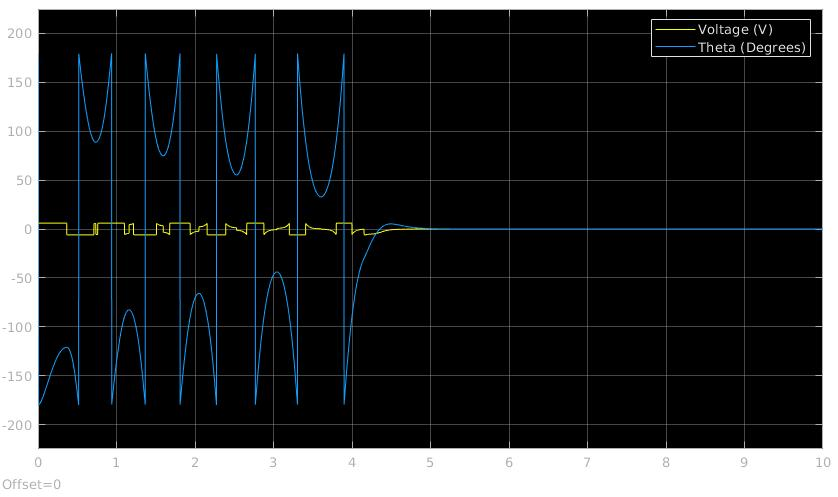

# Furuta Pendulum

This primary goal of this project is to develop an inverted pendulum and control it in its upright position by aplying torque through a dc motor in a horizontal rotary arm.
This project presents various challenges as the system is very unstable and it's not controllable utilizing classical control theory. The space-state was the best aproach since the sistem has single input and mutiple outputs (SIMO), the control of the four states of the plant was also required for its stabilization in the upright position. The Linear–quadratic regulator (LQR) controller design resulted in the most stable option.

This repository contains:

- Dynamic model of the furuta pendulum

- Parameters from the mechanical pendulum

- Controller design: Linear–quadratic regulator, pole-placement design, pendulum swing-up

- Two different closed-loop systems simulations:
   - Full state availability.
   - State estimation with non linear obeserver - unscented Kalman-filter (UKF).
   
- Simulation visualization

- UKF implementation in C/C++ language (not finished)  

### Simulink simulation of the swing-up and control:

### Simulation visualization:

###### Please check the following repositorys of more information on this project.
######   Github repository : [Furuta-Cosimulation](https://github.com/feippolito/Furuta-Cosimulation)
######   Github repository : [Furuta-HIL](https://github.com/feippolito/Furuta-HIL)
######   Github repository : [Furuta-Control](https://github.com/feippolito/Furuta-Control)
